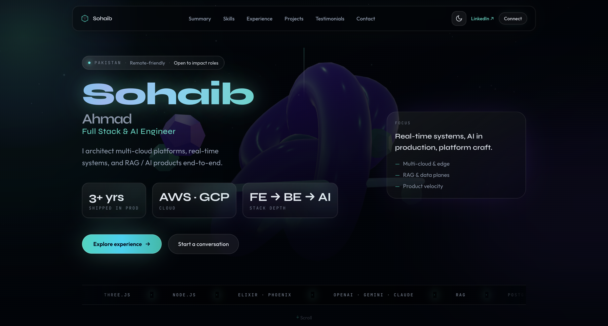
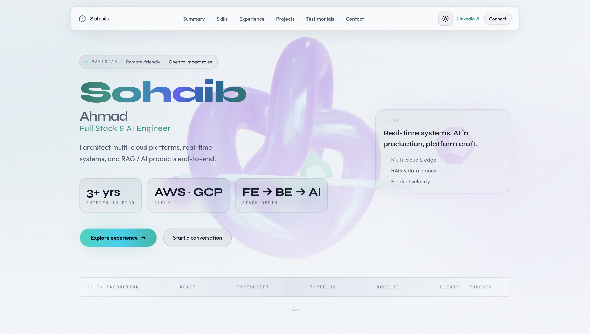
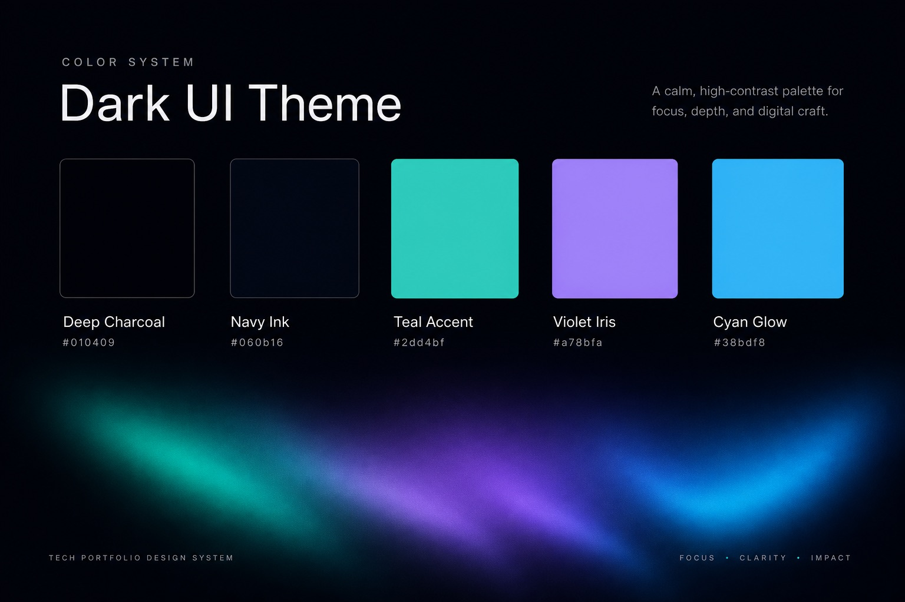
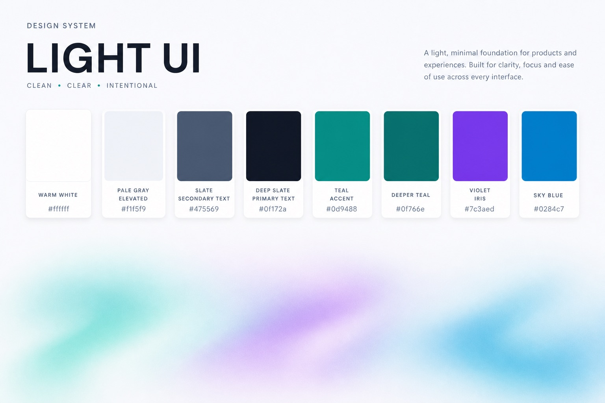
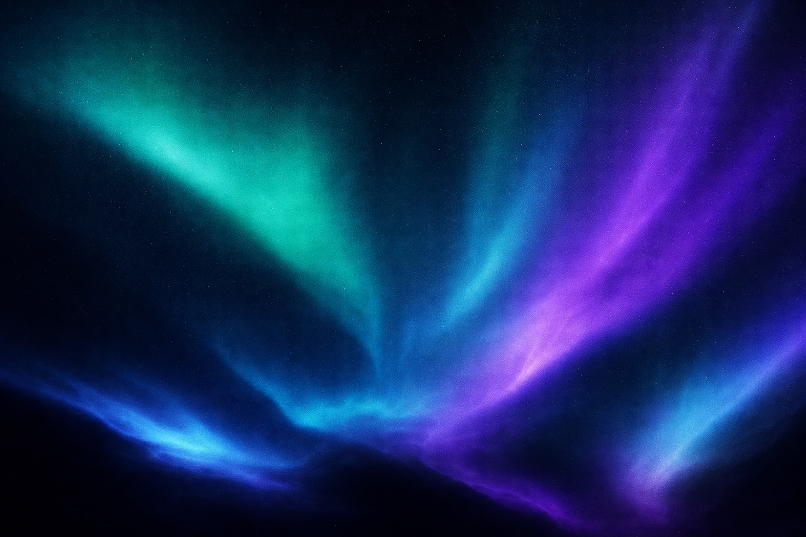

# Sohaib Ahmad — Portfolio

Personal portfolio site for **Sohaib Ahmad** (Full Stack & AI Engineer): multi-cloud systems, real-time products, and production AI / RAG—presented as a single-page experience with a cinematic hero, marquee, case-style sections, and optional Three.js depth.

**Stack:** React 19 · TypeScript · Vite 8 · Tailwind CSS v4 (`@import 'tailwindcss'`) · Framer Motion · Three.js (`@react-three/fiber`, `@react-three/drei`)

## Scripts

```bash
npm install
npm run dev      # local dev + HMR
npm run build    # typecheck + production bundle
npm run preview  # serve build
npm run lint
```

---

## Preview

Hero section from a **production build** at **1440×960** (dark is the default theme; light uses `localStorage` `portfolio-theme` after reload).





### Problem & brief

Engineering portfolios often read as résumés in HTML: high contrast defaults, generic blues, and motion that fights readability. The brief here was the opposite: signal **senior craft**—calm surfaces, a disciplined accent story, and atmosphere that supports credibility without stealing focus from work and metrics.

### Strategic direction

The visual language follows three pillars:

1. **Deep space, not “flat black.”** Backgrounds layer void → ink → surface so the UI feels dimensional and photographic rather than a single `#000` slab.
2. **Bioluminescent accents.** Teal and cyan feel technical and optimistic; violet adds warmth and prevents the palette from reading as “mint startup cliché.” Together they echo aurora and terminal phosphor—appropriate for AI / infra storytelling.
3. **Glass and restraint.** Frosted navigation, hairline borders, and low-amplitude grain sell polish. Motion is slow and ambient by default; aggressive effects degrade or disable on mobile and under `prefers-reduced-motion`.

Light mode is a **paper-and-glass** inversion: airy voids, slate typography, and the same accent DNA tuned for daylight contrast—not a simple color inversion.

### Palette & tokens

Semantic tokens live as `--tp-*` CSS variables on `:root` (dark) and `[data-theme='light']`, mapped into Tailwind via `@theme` in [`src/index.css`](src/index.css). Tune the system there; components consume `color-*` utilities without churn.

**Dark theme — core paints**

| Token | Hex | Role |
| --- | --- | --- |
| Void | `#010409` | Page ground; anchors hero WebGL / static fallback |
| Ink | `#060b16` | Secondary depth |
| Surface | `#0a101f` | Cards / panels |
| Surface elevated | `#0f172a` | Lifted layers |
| Mist | `#94a3b8` | Secondary text |
| Foam | `#e2e8f0` | Primary text |
| Accent | `#2dd4bf` | Primary CTA, links, focus aura |
| Accent dim | `#14b8a6` | Hover / pressed accent |
| Iris | `#a78bfa` | Secondary highlight, gradient stops |
| Glow | `#38bdf8` | Tertiary highlight, sky streaks |

**Aurora gradient anchors** (hero meshes, ambient sections): `#2dd4bf` → `#7c3aed` → `#22d3ee` — implemented as `--tp-aurora-a/b/c` so Three.js, SVG, and CSS gradients stay aligned.

**Light theme — core paints**

| Token | Hex | Role |
| --- | --- | --- |
| Void | `#f4f7fb` | Page ground |
| Ink | `#eef2f7` | Secondary wash |
| Surface | `#ffffff` | Cards |
| Surface elevated | `#f1f5f9` | Elevated panels |
| Mist | `#475569` | Secondary text |
| Foam | `#0f172a` | Primary text |
| Accent | `#0d9488` | CTA (darker for WCAG on light) |
| Iris | `#7c3aed` | Accent companion |
| Glow | `#0284c7` | Sky / link emphasis |

Supporting rails—**borders**, **frost/glass fills**, **nav shadows**, and **selection** colors—use translucent overlays (`rgb` / `color-mix` / `oklab`) so elevation reads correctly in both themes.

### Typography

| Role | Face | Intent |
| --- | --- | --- |
| Display | Syne | Bold, architectural headlines—few words, high impact |
| UI / body | Outfit | Geometric, readable at small sizes; pairs cleanly with Syne |
| Code / proof | JetBrains Mono | Signals implementation depth in stats and technical labels |

Fonts load from Google Fonts in [`index.html`](index.html); Tailwind exposes `--font-sans`, `--font-display`, and `--font-mono` in `@theme`.

### Signature motifs

- **Hero gradient type** — clipped multi-stop gradient on key headlines with soft aurora glow (dark); restrained static gradient in light mode (see `.hero-gradient-text` in [`src/index.css`](src/index.css)).
- **Ambient sections** — radial washes using `color-mix` with `--color-aurora-a` for continuity between blocks.
- **Primary button** — teal→cyan→teal ramp with inset highlight and accent-colored outer bloom; tuned separately per theme.
- **Film grain** — fixed overlay at low opacity; disabled on small viewports where noise shaders cost frames.

### Accessibility & performance guardrails

- `prefers-reduced-motion`: disables marquee drift, aurora float, card shine sweep, and gradient drift where they would distract.
- Mobile: backdrop blur and grain reduced or removed to protect scrolling on Safari / low-power GPUs.
- Theme persistence: `portfolio-theme` in `localStorage`, with `prefers-color-scheme` fallback (see [`index.html`](index.html)).

### Case study visuals

Dark palette poster (conceptual swatches + aurora thread):



Light palette poster (paper-and-glass inversion, same accent story):



Atmospheric mood reference aligned with hero aurora meshes:



---

## Project structure (high level)

- [`src/index.css`](src/index.css) — design tokens, `@theme`, utilities, component classes (`btn-primary`, `nav-glass`, etc.)
- [`src/theme/`](src/theme/) — React theme context / provider
- [`src/data/content.ts`](src/data/content.ts) — copy, marquee strip, contact blocks
- [`src/components/`](src/components/) — Hero background, cursor, cards, shared UI
- [`src/sections/`](src/sections/) — Page sections composed into the main layout

---

## License

This project is released under the [MIT License](LICENSE).

MIT fits well here: anyone may **use, change, and redistribute** the code for commercial or non-commercial purposes; legally they must **keep the copyright and license notice** (usually in a `LICENSE` or notices file in their fork).

If you build on this template or reuse substantial parts, please **credit Sohaib Ahmad** — for example a short note in your README or site footer with a link to LinkedIn: [**Sohaib Ahmad**](https://www.linkedin.com/in/malik-sohaib). That attribution is a courtesy the MIT license does not spell out, but it helps others discover the original work.

Third-party assets (fonts from Google Fonts, npm packages, etc.) remain under their respective licenses.

[`package.json`](package.json) sets `"private": true` only so the package is not accidentally published to the npm registry; the source itself is intended to be public on GitHub.
