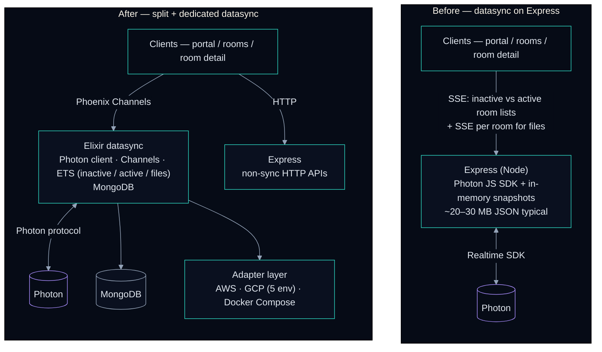

# Photon datasync — Express / SSE → Elixir / Channels

Architecture before and after carving **room + file metadata sync** out of **Express** into a dedicated **Elixir** service. Styling follows [`STYLE_GUIDE.md`](../STYLE_GUIDE.md).

**Bundled in the site:** [`photon-elixir-phoenix.mmd`](../../../src/data/architecture/photon-elixir-phoenix.mmd) contains the **flowchart only**; the case study applies **dark or light** Mermaid styling from [`mermaidThemedDefinition.ts`](../../../src/data/architecture/mermaidThemedDefinition.ts) to match the site theme. The fence below is a **dark reference** for GitHub / markdown previews—update the `flowchart TB …` portion alongside the `.mmd` file when the graph changes.

### Reading notes

- **Before:** Multiple long-lived **SSE** connections per user (list streams plus per-room file streams) shared the **same Express** process as unrelated APIs, with Photon accessed via the **JavaScript SDK** and large snapshots held in **Node memory**.
- **After:** Browsers subscribe via **Phoenix Channels**; Photon is spoken from **Elixir** with a **custom client** (JS SDK as reference). **MongoDB** and **cloud adapters** support multi-region deployment; **Express** remains for the rest of the HTTP surface.
